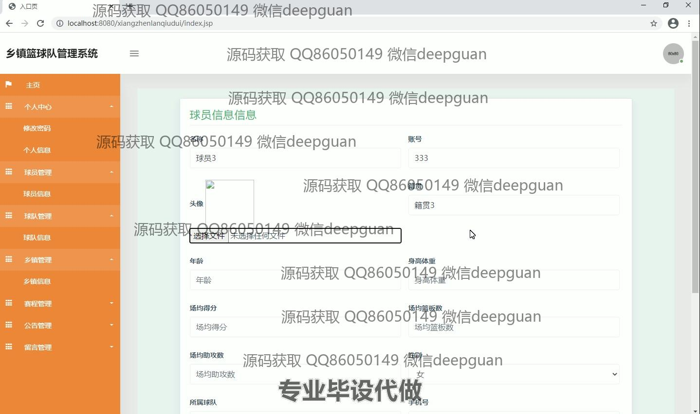
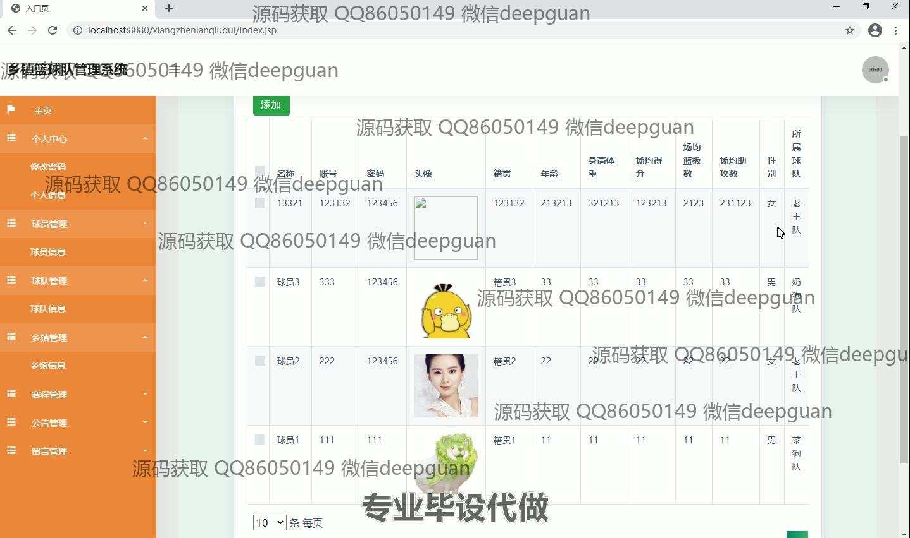

<h1 align="center">基于SSM的乡镇篮球队管理系统</h1>

## 简介
乡镇篮球队管理系统：角色分为管理员和普通用户；提供用户管理、球队管理、球员管理、乡镇管理、赛程管理、成绩统计、公告与留言功能，简化篮球队事务管理。    --计算机毕业设计源码；毕设源码；java毕业设计源码

## 联系方式

<h3 align="center">获取完整代码与数据库文件 + 微信：deepguan QQ: 86050149 QQ群: 783742310</h3>

<h3 align="center">可帮忙远程部署 包运行成功！提供远程部署、修改代码、设计文档指导、代码讲解等服务！</h3>

## 功能介绍（完整见运行截图）
管理员：管理乡镇篮球队的信息，包括添加、修改和删除球队及球员信息，安排赛事及更新比赛结果。可以发布公告，管理留言信息，通过系统导航栏访问各模块，对用户信息进行审核和管理。还支持管理乡镇信息及调整赛程，提供赛事结果的统计与分析。可以通过页面编辑信息，实现对篮球队的全面管理。

教练：登录后可以查看和管理所在球队的详细信息，包括球员的基本数据和比赛成绩。可安排球队训练计划和查看比赛日程，输入和更新球员表现及比赛结果。同时可以向管理员提交球员信息的增删改请求，并查看公告和留言，促进队内交流和管理效率。

球员：可以登录系统查看个人信息和所在球队的基本情况，更新个人资料，并查看赛程安排，以及球队的比赛成绩和排名。球员还可以通过系统与教练和管理员进行信息交流，接收公告和参与留言活动，反馈关于比赛和训练的建议和意见。

用户：作为观众或管理对象，注册后可以查询球队信息、乡镇篮球赛事安排和比赛结果。可以浏览公告以及乡镇管理的相关政策，参与留言和讨论。用户能够通过界面了解篮球赛事的最新动态，并随时与系统管理员进行交流，获取球队或比赛的最新信息。

## 运行截图

本代码来源于网络,仅供学习参考使用!

